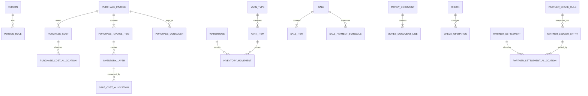

# معماری سامانه

## انتخاب معماری

یک modular monolith انتخاب شده است: یک ASP.NET Core 8 API، یک React/TypeScript SPA و یک SQL Server. این ساختار کم‌هزینه‌ترین گزینه‌ای است که تراکنش، تست‌پذیری، امنیت نقش‌محور و گزارش‌گیری موردنیاز را حفظ می‌کند. سرویس جداگانه، message broker و موتور حسابداری عمومی وجود ندارد.

## ماژول‌ها

- Master Data: اشخاص و نقش‌ها، نخ، انبار و نرخ ارز
- Purchasing: فاکتور، packing list، کانتینر، هزینه واردات، پیوست و واردکننده XLSX
- Inventory: حرکت تغییرناپذیر و لایه هزینه
- Pricing & Sales: لیست قیمت، قواعد اعتبار، فروش و برنامه پرداخت
- Finance: دریافت/پرداخت، چک و عملیات چک
- Partnership: قواعد سهم، دفتر شریک و تسویه
- Reporting: موجودی، چک، دفتر شریک و گزارش جامع مشارکت
- Cross-cutting: Identity، authorization، audit، localization و attachment storage

## مرز تراکنش

Posting خرید یا فروش در یک transaction دیتابیس انجام می‌شود. هر خطا کل عملیات را rollback می‌کند. سند posted مستقیماً ویرایش یا حذف نمی‌شود؛ اصلاح با reversal/adjustment است.

## ERD فشرده

## امنیت و استقرار

- احراز هویت با ASP.NET Core Identity و bearer token داخلی است.
- نقش‌های نسخه اول seed می‌شوند.
- پیوست‌ها خارج از جداول تراکنشی در `App_Data/attachments` ذخیره و با SHA-256 کنترل می‌شوند.
- رمز عبور seed فقط برای توسعه است و باید در اولین ورود تغییر کند.
- رشتهٔ اتصال در Development از .NET User Secrets و در محیط‌های عملیاتی از تنظیمات محافظت‌شده تأمین می‌شود. اتصال SQL باید رمزگذاری شود و گواهی سرور اعتبارسنجی شود؛ برنامه در محیط غیر از Development مقدارهای `Encrypt=True` و `TrustServerCertificate=False` را الزام می‌کند. جزئیات TLS سرویس در README آمده است.

